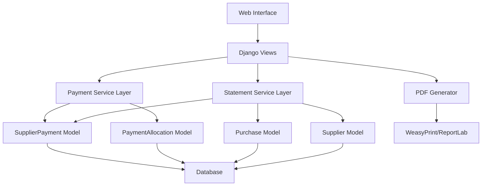
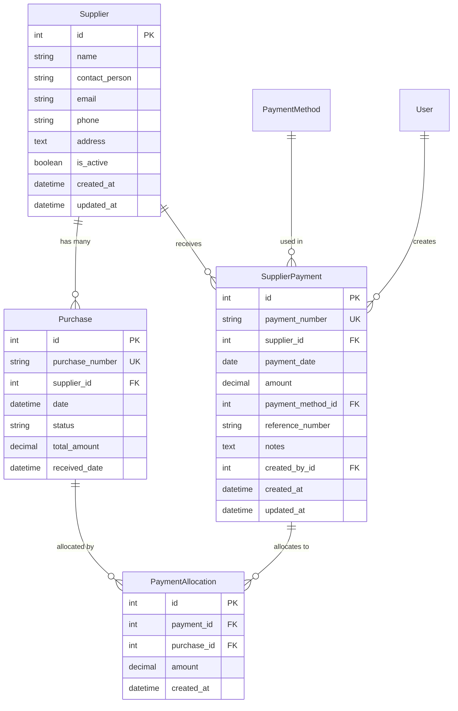

# Design Document: Supplier Statements and Payment Tracking

## Overview

This design implements a comprehensive supplier payment tracking and statement generation system for a Django POS application. The solution extends the existing Supplier and Purchase models with new models for tracking payments and payment allocations. It provides views for recording payments, generating statements with aging analysis, and producing printable/PDF reports.

The design follows Django best practices, integrates with the existing model structure, and ensures data integrity through proper validation and database transactions.

## Architecture

### High-Level Architecture



### Component Interaction Flow

1. **Payment Recording Flow**: User submits payment → View validates → Service creates SupplierPayment → Service creates PaymentAllocations → Database transaction commits
2. **Statement Generation Flow**: User requests statement → View calls service → Service queries purchases and payments → Service calculates running balance → Template renders statement
3. **Aging Analysis Flow**: View requests aging data → Service queries unpaid purchases → Service categorizes by age → Service aggregates by supplier → Template displays aging report

## Components and Interfaces

### Models

#### SupplierPayment Model

```python
class SupplierPayment(models.Model):
    """Records payments made to suppliers"""
    payment_number = models.CharField(max_length=20, unique=True, editable=False)
    supplier = models.ForeignKey(Supplier, on_delete=models.PROTECT, related_name='payments')
    payment_date = models.DateField(default=timezone.now)
    amount = models.DecimalField(max_digits=10, decimal_places=2, validators=[MinValueValidator(Decimal('0.01'))])
    payment_method = models.ForeignKey(PaymentMethod, on_delete=models.PROTECT)
    reference_number = models.CharField(max_length=100, blank=True)
    notes = models.TextField(blank=True)
    created_by = models.ForeignKey(User, on_delete=models.PROTECT, related_name='supplier_payments_created')
    created_at = models.DateTimeField(auto_now_add=True)
    updated_at = models.DateTimeField(auto_now=True)
    
    class Meta:
        ordering = ['-payment_date', '-created_at']
        indexes = [
            models.Index(fields=['supplier', 'payment_date']),
            models.Index(fields=['payment_date']),
        ]
    
    def save(self, *args, **kwargs):
        # Generate payment number: PAY-YYYYMMDD-XXXX
        if not self.payment_number:
            today = timezone.now()
            date_str = today.strftime('%Y%m%d')
            last_payment = SupplierPayment.objects.filter(
                payment_number__startswith=f'PAY-{date_str}'
            ).order_by('-payment_number').first()
            if last_payment:
                last_num = int(last_payment.payment_number.split('-')[-1])
                new_num = last_num + 1
            else:
                new_num = 1
            self.payment_number = f'PAY-{date_str}-{new_num:04d}'
        super().save(*args, **kwargs)
    
    def total_allocated(self):
        """Returns the total amount allocated to purchases"""
        return self.allocations.aggregate(
            total=models.Sum('amount')
        )['total'] or Decimal('0.00')
    
    def unallocated_amount(self):
        """Returns the amount not yet allocated to specific purchases"""
        return self.amount - self.total_allocated()
```

#### PaymentAllocation Model

```python
class PaymentAllocation(models.Model):
    """Tracks allocation of payments to specific purchases"""
    payment = models.ForeignKey(SupplierPayment, on_delete=models.CASCADE, related_name='allocations')
    purchase = models.ForeignKey(Purchase, on_delete=models.PROTECT, related_name='payment_allocations')
    amount = models.DecimalField(max_digits=10, decimal_places=2, validators=[MinValueValidator(Decimal('0.01'))])
    created_at = models.DateTimeField(auto_now_add=True)
    
    class Meta:
        ordering = ['created_at']
        indexes = [
            models.Index(fields=['payment']),
            models.Index(fields=['purchase']),
        ]
    
    def clean(self):
        # Validate allocation amount doesn't exceed payment amount
        if self.amount > self.payment.amount:
            raise ValidationError("Allocation amount cannot exceed payment amount")
        
        # Validate total allocations for this payment don't exceed payment amount
        existing_allocations = PaymentAllocation.objects.filter(
            payment=self.payment
        ).exclude(pk=self.pk).aggregate(total=models.Sum('amount'))['total'] or Decimal('0.00')
        
        if existing_allocations + self.amount > self.payment.amount:
            raise ValidationError("Total allocations exceed payment amount")
        
        # Validate total allocations for this purchase don't exceed purchase total
        existing_purchase_allocations = PaymentAllocation.objects.filter(
            purchase=self.purchase
        ).exclude(pk=self.pk).aggregate(total=models.Sum('amount'))['total'] or Decimal('0.00')
        
        if existing_purchase_allocations + self.amount > self.purchase.total_amount:
            raise ValidationError("Total allocations exceed purchase amount")
```

#### Extended Supplier Model Methods

```python
# Add these methods to the existing Supplier model

def outstanding_balance(self):
    """Calculate current outstanding balance"""
    total_purchases = self.purchases.filter(
        status='received'
    ).aggregate(total=models.Sum('total_amount'))['total'] or Decimal('0.00')
    
    total_payments = self.payments.aggregate(
        total=models.Sum('amount')
    )['total'] or Decimal('0.00')
    
    return total_purchases - total_payments

def total_payments(self):
    """Calculate total payments made to this supplier"""
    return self.payments.aggregate(
        total=models.Sum('amount')
    )['total'] or Decimal('0.00')
```

#### Extended Purchase Model Methods

```python
# Add these methods to the existing Purchase model

def total_allocated(self):
    """Returns total amount allocated from payments"""
    return self.payment_allocations.aggregate(
        total=models.Sum('amount')
    )['total'] or Decimal('0.00')

def remaining_balance(self):
    """Returns unpaid balance"""
    return self.total_amount - self.total_allocated()

def is_fully_paid(self):
    """Check if purchase is fully paid"""
    return self.remaining_balance() <= Decimal('0.00')

def days_outstanding(self):
    """Calculate days since purchase date"""
    if self.status != 'received' or self.is_fully_paid():
        return 0
    return (timezone.now().date() - self.date.date()).days

def aging_category(self):
    """Return aging category: current, 30, 60, 90+"""
    days = self.days_outstanding()
    if days <= 30:
        return 'current'
    elif days <= 60:
        return '30_days'
    elif days <= 90:
        return '60_days'
    else:
        return '90_plus'
```

### Service Layer

#### SupplierPaymentService

```python
class SupplierPaymentService:
    """Business logic for supplier payments"""
    
    @staticmethod
    @transaction.atomic
    def create_payment(supplier, amount, payment_date, payment_method, 
                      reference_number, notes, created_by, allocations=None):
        """
        Create a supplier payment with optional allocations
        
        Args:
            supplier: Supplier instance
            amount: Decimal payment amount
            payment_date: Date of payment
            payment_method: PaymentMethod instance
            reference_number: Optional reference string
            notes: Optional notes string
            created_by: User instance
            allocations: Optional list of dicts [{'purchase': Purchase, 'amount': Decimal}]
        
        Returns:
            SupplierPayment instance
        
        Raises:
            ValidationError: If validation fails
        """
        # Validate supplier is active
        if not supplier.is_active:
            raise ValidationError("Cannot create payment for inactive supplier")
        
        # Validate payment method is active
        if not payment_method.is_active:
            raise ValidationError("Cannot use inactive payment method")
        
        # Validate amount
        if amount <= Decimal('0.00'):
            raise ValidationError("Payment amount must be greater than zero")
        
        # Create payment
        payment = SupplierPayment.objects.create(
            supplier=supplier,
            amount=amount,
            payment_date=payment_date,
            payment_method=payment_method,
            reference_number=reference_number,
            notes=notes,
            created_by=created_by
        )
        
        # Create allocations if provided
        if allocations:
            total_allocated = Decimal('0.00')
            for alloc in allocations:
                purchase = alloc['purchase']
                alloc_amount = alloc['amount']
                
                # Validate purchase belongs to supplier
                if purchase.supplier != supplier:
                    raise ValidationError(f"Purchase {purchase.purchase_number} does not belong to this supplier")
                
                # Validate purchase is received
                if purchase.status != 'received':
                    raise ValidationError(f"Purchase {purchase.purchase_number} is not received")
                
                # Validate allocation doesn't exceed remaining balance
                remaining = purchase.remaining_balance()
                if alloc_amount > remaining:
                    raise ValidationError(
                        f"Allocation amount {alloc_amount} exceeds remaining balance {remaining} "
                        f"for purchase {purchase.purchase_number}"
                    )
                
                PaymentAllocation.objects.create(
                    payment=payment,
                    purchase=purchase,
                    amount=alloc_amount
                )
                total_allocated += alloc_amount
            
            # Validate total allocations don't exceed payment amount
            if total_allocated > amount:
                raise ValidationError("Total allocations exceed payment amount")
        else:
            # Auto-allocate using FIFO if no allocations specified
            SupplierPaymentService._auto_allocate_payment(payment)
        
        # Log activity
        ActivityLog.log_activity(
            user=created_by,
            action_type='create',
            description=f'Created supplier payment {payment.payment_number} for {supplier.name}',
            model_name='SupplierPayment',
            object_id=payment.id
        )
        
        return payment
    
    @staticmethod
    def _auto_allocate_payment(payment):
        """Automatically allocate payment to oldest unpaid purchases using FIFO"""
        remaining_amount = payment.amount
        
        # Get unpaid purchases ordered by date (oldest first)
        unpaid_purchases = Purchase.objects.filter(
            supplier=payment.supplier,
            status='received'
        ).annotate(
            allocated=Coalesce(Sum('payment_allocations__amount'), Decimal('0.00'))
        ).filter(
            allocated__lt=F('total_amount')
        ).order_by('date')
        
        for purchase in unpaid_purchases:
            if remaining_amount <= Decimal('0.00'):
                break
            
            purchase_remaining = purchase.remaining_balance()
            allocation_amount = min(remaining_amount, purchase_remaining)
            
            PaymentAllocation.objects.create(
                payment=payment,
                purchase=purchase,
                amount=allocation_amount
            )
            
            remaining_amount -= allocation_amount
```

#### SupplierStatementService

```python
class SupplierStatementService:
    """Business logic for generating supplier statements"""
    
    @staticmethod
    def generate_statement(supplier, start_date=None, end_date=None):
        """
        Generate statement data for a supplier
        
        Args:
            supplier: Supplier instance
            start_date: Optional start date (defaults to earliest transaction)
            end_date: Optional end date (defaults to today)
        
        Returns:
            dict with statement data
        """
        if end_date is None:
            end_date = timezone.now().date()
        
        # Calculate opening balance (transactions before start_date)
        opening_balance = Decimal('0.00')
        if start_date:
            opening_purchases = supplier.purchases.filter(
                status='received',
                date__lt=start_date
            ).aggregate(total=Sum('total_amount'))['total'] or Decimal('0.00')
            
            opening_payments = supplier.payments.filter(
                payment_date__lt=start_date
            ).aggregate(total=Sum('amount'))['total'] or Decimal('0.00')
            
            opening_balance = opening_purchases - opening_payments
        
        # Get transactions in period
        purchases = supplier.purchases.filter(
            status='received',
            date__gte=start_date if start_date else timezone.datetime.min,
            date__lte=timezone.datetime.combine(end_date, timezone.datetime.max.time())
        ).order_by('date')
        
        payments = supplier.payments.filter(
            payment_date__gte=start_date if start_date else timezone.datetime.min.date(),
            payment_date__lte=end_date
        ).order_by('payment_date')
        
        # Combine and sort transactions
        transactions = []
        
        for purchase in purchases:
            transactions.append({
                'date': purchase.date.date(),
                'type': 'purchase',
                'reference': purchase.purchase_number,
                'description': f'Purchase: {purchase.purchase_number}',
                'debit': purchase.total_amount,
                'credit': Decimal('0.00'),
                'object': purchase
            })
        
        for payment in payments:
            transactions.append({
                'date': payment.payment_date,
                'type': 'payment',
                'reference': payment.payment_number,
                'description': f'Payment: {payment.payment_method.name}',
                'debit': Decimal('0.00'),
                'credit': payment.amount,
                'object': payment
            })
        
        # Sort by date
        transactions.sort(key=lambda x: x['date'])
        
        # Calculate running balance
        running_balance = opening_balance
        for trans in transactions:
            running_balance += trans['debit'] - trans['credit']
            trans['balance'] = running_balance
        
        closing_balance = running_balance
        
        return {
            'supplier': supplier,
            'start_date': start_date,
            'end_date': end_date,
            'opening_balance': opening_balance,
            'closing_balance': closing_balance,
            'transactions': transactions,
            'total_purchases': sum(t['debit'] for t in transactions),
            'total_payments': sum(t['credit'] for t in transactions),
        }
    
    @staticmethod
    def generate_aging_analysis(as_of_date=None):
        """
        Generate aging analysis for all suppliers
        
        Args:
            as_of_date: Optional date for aging calculation (defaults to today)
        
        Returns:
            list of dicts with aging data per supplier
        """
        if as_of_date is None:
            as_of_date = timezone.now().date()
        
        suppliers_with_balance = Supplier.objects.filter(
            purchases__status='received'
        ).distinct()
        
        aging_data = []
        
        for supplier in suppliers_with_balance:
            # Get unpaid or partially paid purchases
            purchases = Purchase.objects.filter(
                supplier=supplier,
                status='received'
            ).annotate(
                allocated=Coalesce(Sum('payment_allocations__amount'), Decimal('0.00'))
            ).filter(
                allocated__lt=F('total_amount')
            )
            
            current = Decimal('0.00')
            days_30 = Decimal('0.00')
            days_60 = Decimal('0.00')
            days_90_plus = Decimal('0.00')
            
            for purchase in purchases:
                remaining = purchase.remaining_balance()
                days_old = (as_of_date - purchase.date.date()).days
                
                if days_old <= 30:
                    current += remaining
                elif days_old <= 60:
                    days_30 += remaining
                elif days_old <= 90:
                    days_60 += remaining
                else:
                    days_90_plus += remaining
            
            total_outstanding = current + days_30 + days_60 + days_90_plus
            
            if total_outstanding > Decimal('0.00'):
                aging_data.append({
                    'supplier': supplier,
                    'current': current,
                    '30_days': days_30,
                    '60_days': days_60,
                    '90_plus': days_90_plus,
                    'total': total_outstanding
                })
        
        return aging_data
```

## Data Models

### Entity Relationship Diagram



### Database Indexes

- `SupplierPayment`: Index on `(supplier_id, payment_date)` for efficient statement queries
- `SupplierPayment`: Index on `payment_date` for date range queries
- `PaymentAllocation`: Index on `payment_id` for allocation lookups
- `PaymentAllocation`: Index on `purchase_id` for purchase payment status

## Correctness Properties

*A property is a characteristic or behavior that should hold true across all valid executions of a system—essentially, a formal statement about what the system should do. Properties serve as the bridge between human-readable specifications and machine-verifiable correctness guarantees.*


### Property 1: Payment Data Persistence

*For any* supplier payment created with valid data (amount, date, payment method, reference, notes, user), querying the payment back from the database should return all fields with their original values including audit fields (created_by, created_at).

**Validates: Requirements 1.1, 1.2, 1.6**

### Property 2: Outstanding Balance Calculation

*For any* supplier, the outstanding balance should always equal the sum of all received purchase totals minus the sum of all payment amounts.

**Validates: Requirements 2.1, 2.5**

### Property 3: Payment Reduces Balance

*For any* supplier with an initial outstanding balance, creating a valid payment should reduce the outstanding balance by exactly the payment amount.

**Validates: Requirements 1.3, 2.2, 2.3, 2.4**

### Property 4: Invalid Payment Rejection

*For any* payment with an amount less than or equal to zero, the system should reject the payment and raise a validation error.

**Validates: Requirements 1.4**

### Property 5: Payment Allocation Recording

*For any* payment created with allocation data, each allocation should be persisted with the correct payment, purchase, and amount, and the payment should allow multiple allocations.

**Validates: Requirements 1.5, 7.1, 7.2**

### Property 6: Statement Transaction Filtering

*For any* supplier and date range, the generated statement should include all and only the received purchases and payments with dates within the specified range.

**Validates: Requirements 3.1, 3.2**

### Property 7: Statement Chronological Ordering

*For any* generated statement, each transaction should have a date greater than or equal to the previous transaction's date (chronologically sorted).

**Validates: Requirements 3.3**

### Property 8: Running Balance Calculation

*For any* statement transaction sequence, each transaction's running balance should equal the previous balance plus the transaction's debit minus the transaction's credit.

**Validates: Requirements 3.4**

### Property 9: Statement Opening Balance

*For any* statement with a start date, the opening balance should equal the sum of all received purchases before the start date minus the sum of all payments before the start date.

**Validates: Requirements 3.5**

### Property 10: Statement Closing Balance

*For any* statement, the closing balance should equal the opening balance plus the sum of all debits minus the sum of all credits in the period.

**Validates: Requirements 3.6**

### Property 11: Statement Completeness

*For any* generated statement (printable or PDF), the output should contain the supplier's name, contact information, address, and the business's name, address, and contact information.

**Validates: Requirements 3.7, 3.8, 5.3**

### Property 12: Payment History Filtering

*For any* supplier, the payment history view should display all and only the payments associated with that supplier.

**Validates: Requirements 4.1**

### Property 13: Payment History Field Display

*For any* payment in the payment history, the display should include the payment date, amount, payment method name, and reference number.

**Validates: Requirements 4.2**

### Property 14: Payment History Reverse Chronological Order

*For any* payment history list, each payment should have a date less than or equal to the previous payment's date (newest first).

**Validates: Requirements 4.3**

### Property 15: Payment History Total

*For any* supplier's payment history, the displayed total should equal the sum of all payment amounts for that supplier.

**Validates: Requirements 4.4**

### Property 16: Payment History Date Range Filter

*For any* date range filter applied to payment history, only payments with payment_date within the range should be displayed.

**Validates: Requirements 4.5**

### Property 17: Aging Category Assignment

*For any* unpaid or partially paid purchase, it should be assigned to exactly one aging category (current, 30 days, 60 days, or 90+ days) based on the number of days since the purchase date.

**Validates: Requirements 6.1, 6.2**

### Property 18: Aging Amount Aggregation

*For any* supplier in the aging analysis, the sum of amounts in each aging category should equal the sum of remaining balances for all unpaid/partially paid purchases in those age ranges.

**Validates: Requirements 6.3**

### Property 19: Aging Analysis Supplier Filtering

*For any* aging analysis report, it should include all and only suppliers that have at least one unpaid or partially paid purchase.

**Validates: Requirements 6.5**

### Property 20: Fully Paid Purchase Exclusion

*For any* purchase where total allocations equal the purchase total amount, it should not appear in the aging analysis.

**Validates: Requirements 6.6**

### Property 21: Partial Payment Aging Amount

*For any* partially paid purchase in aging analysis, the amount included should equal the purchase total minus the sum of all payment allocations for that purchase.

**Validates: Requirements 6.7**

### Property 22: Allocation Total Calculation

*For any* purchase, the total allocated amount should equal the sum of all payment allocation amounts for that purchase, and when this equals the purchase total, is_fully_paid() should return true.

**Validates: Requirements 7.3, 7.4, 7.5**

### Property 23: FIFO Auto-Allocation

*For any* payment created without explicit allocations, the payment should be automatically allocated to unpaid purchases in chronological order (oldest first), allocating the full remaining balance of each purchase before moving to the next.

**Validates: Requirements 7.6**

### Property 24: Supplier List Display

*For any* supplier list view, each supplier should be displayed with their name and current outstanding balance.

**Validates: Requirements 8.1**

### Property 25: Supplier List Sorting

*For any* supplier list with a sort parameter (name or balance), the list should be ordered according to that parameter in ascending or descending order as specified.

**Validates: Requirements 8.2**

### Property 26: Supplier List Balance Filter

*For any* supplier list with the outstanding balance filter applied, only suppliers with outstanding_balance() > 0 should be displayed.

**Validates: Requirements 8.3**

### Property 27: Supplier List Total

*For any* supplier list view, the displayed total outstanding balance should equal the sum of outstanding_balance() for all displayed suppliers.

**Validates: Requirements 8.4**

### Property 28: Inactive Supplier Validation

*For any* attempt to create a payment for an inactive supplier, the system should raise a validation error and prevent payment creation.

**Validates: Requirements 9.1**

### Property 29: Inactive Payment Method Validation

*For any* attempt to create a payment with an inactive payment method, the system should raise a validation error and prevent payment creation.

**Validates: Requirements 9.2**

### Property 30: Allocation Amount Validation

*For any* payment allocation, if the allocation amount exceeds the payment amount, the system should raise a validation error and prevent allocation creation.

**Validates: Requirements 9.3**

### Property 31: Purchase Over-Allocation Prevention

*For any* purchase, the sum of all payment allocation amounts should never exceed the purchase total amount, and attempts to create allocations that would violate this should be rejected.

**Validates: Requirements 9.4**

### Property 32: Payment Deletion Balance Update

*For any* payment that is deleted, the supplier's outstanding balance after deletion should equal what it was before the payment was originally created.

**Validates: Requirements 9.6**

### Property 33: Purchase Deletion Protection

*For any* purchase that has one or more payment allocations, attempts to delete the purchase should be prevented by the system.

**Validates: Requirements 9.7**

### Property 34: Audit Trail Completeness

*For any* payment, the created_by and created_at fields should be populated on creation, and the updated_at field should be updated whenever the payment is modified, and these fields should be displayed in the payment detail view.

**Validates: Requirements 10.1, 10.2, 10.4**

### Property 35: Deletion Activity Logging

*For any* payment deletion, an activity log entry should be created with the deleting user, timestamp, and action type 'delete'.

**Validates: Requirements 10.3**

## Error Handling

### Validation Errors

The system handles validation errors at multiple levels:

1. **Model-level validation**: Django model validators ensure data integrity (e.g., MinValueValidator for payment amounts)
2. **Service-level validation**: Business logic validation in service methods (e.g., checking supplier is active)
3. **Form-level validation**: Django forms provide user-friendly error messages

### Error Scenarios

| Scenario | Error Type | Handling |
|----------|------------|----------|
| Payment amount ≤ 0 | ValidationError | Display error message, prevent save |
| Inactive supplier | ValidationError | Display error message, prevent payment creation |
| Inactive payment method | ValidationError | Display error message, prevent payment creation |
| Allocation exceeds payment | ValidationError | Display error message, prevent allocation |
| Allocation exceeds purchase balance | ValidationError | Display error message with remaining balance |
| Total allocations exceed payment | ValidationError | Display error message with available amount |
| Delete purchase with allocations | ProtectedError | Display error message, prevent deletion |
| Database transaction failure | DatabaseError | Rollback transaction, display generic error |
| PDF generation failure | Exception | Log error, display user-friendly message |

### Transaction Management

All payment creation operations use Django's `@transaction.atomic` decorator to ensure:
- Payment and allocations are created atomically
- Rollback occurs if any validation fails
- Database consistency is maintained

## Testing Strategy

### Dual Testing Approach

The testing strategy employs both unit tests and property-based tests:

- **Unit tests**: Verify specific examples, edge cases, and error conditions
- **Property tests**: Verify universal properties across all inputs using randomized data

### Property-Based Testing

Property-based tests will be implemented using the `hypothesis` library for Python/Django. Each test will:
- Run a minimum of 100 iterations with randomized inputs
- Reference the corresponding design property
- Use the tag format: **Feature: supplier-statements-and-payments, Property {number}: {property_text}**

Example property test structure:

```python
from hypothesis import given, strategies as st
from hypothesis.extra.django import TestCase

class SupplierPaymentPropertyTests(TestCase):
    @given(
        amount=st.decimals(min_value='0.01', max_value='999999.99', places=2),
        payment_date=st.dates(),
    )
    @settings(max_examples=100)
    def test_property_3_payment_reduces_balance(self, amount, payment_date):
        """
        Feature: supplier-statements-and-payments, Property 3: Payment Reduces Balance
        For any supplier with an initial outstanding balance, creating a valid payment 
        should reduce the outstanding balance by exactly the payment amount.
        """
        # Test implementation
        pass
```

### Unit Testing Focus

Unit tests should focus on:
- Specific examples demonstrating correct behavior (e.g., statement with 3 purchases and 2 payments)
- Edge cases (e.g., empty statement, single transaction, payment on same day as purchase)
- Error conditions (e.g., invalid payment amount, inactive supplier)
- Integration points (e.g., PDF generation, activity logging)
- UI rendering (e.g., template context contains expected data)

### Test Coverage Areas

1. **Model Tests**
   - SupplierPayment model methods (total_allocated, unallocated_amount)
   - PaymentAllocation validation (clean method)
   - Extended Supplier methods (outstanding_balance, total_payments)
   - Extended Purchase methods (remaining_balance, is_fully_paid, aging_category)

2. **Service Tests**
   - SupplierPaymentService.create_payment with various allocation scenarios
   - Auto-allocation FIFO logic
   - SupplierStatementService.generate_statement with different date ranges
   - SupplierStatementService.generate_aging_analysis

3. **View Tests**
   - Payment creation form submission
   - Statement generation with date filters
   - Payment history display and filtering
   - Aging analysis display
   - PDF generation

4. **Integration Tests**
   - Complete payment workflow (create payment → allocate → verify balance)
   - Statement generation with mixed transactions
   - Aging analysis with multiple suppliers and purchases
   - Payment deletion and balance recalculation

### Test Data Generation

For property-based tests, use Hypothesis strategies to generate:
- Valid decimal amounts (0.01 to 999999.99)
- Random dates within reasonable ranges
- Random supplier and purchase data
- Random allocation scenarios

For unit tests, use Django fixtures or factory_boy to create:
- Suppliers with various states (active/inactive)
- Purchases with different statuses and dates
- Payments with different methods and allocations
- Complete scenarios (e.g., supplier with 5 purchases and 3 payments)

## Views and URLs

### URL Structure

```python
# urls.py additions
urlpatterns = [
    # Payment management
    path('suppliers/<int:supplier_id>/payments/', views.supplier_payments, name='supplier_payments'),
    path('suppliers/<int:supplier_id>/payments/create/', views.create_payment, name='create_payment'),
    path('payments/<int:payment_id>/', views.payment_detail, name='payment_detail'),
    path('payments/<int:payment_id>/delete/', views.delete_payment, name='delete_payment'),
    
    # Statements
    path('suppliers/<int:supplier_id>/statement/', views.supplier_statement, name='supplier_statement'),
    path('suppliers/<int:supplier_id>/statement/pdf/', views.supplier_statement_pdf, name='supplier_statement_pdf'),
    path('suppliers/<int:supplier_id>/statement/print/', views.supplier_statement_print, name='supplier_statement_print'),
    
    # Aging analysis
    path('suppliers/aging/', views.aging_analysis, name='aging_analysis'),
    
    # Supplier list with balances
    path('suppliers/balances/', views.supplier_balances, name='supplier_balances'),
]
```

### View Specifications

#### create_payment View

- **Method**: GET (display form), POST (process form)
- **Parameters**: supplier_id
- **Form fields**: amount, payment_date, payment_method, reference_number, notes, allocations (formset)
- **Validation**: Use SupplierPaymentService.create_payment
- **Success**: Redirect to supplier_payments with success message
- **Error**: Re-display form with error messages

#### supplier_statement View

- **Method**: GET
- **Parameters**: supplier_id, start_date (optional), end_date (optional)
- **Service**: SupplierStatementService.generate_statement
- **Template**: Renders HTML statement with transaction table
- **Context**: statement data, supplier, date range

#### supplier_statement_pdf View

- **Method**: GET
- **Parameters**: supplier_id, start_date (optional), end_date (optional)
- **Service**: SupplierStatementService.generate_statement
- **PDF Library**: WeasyPrint or ReportLab
- **Response**: PDF file download

#### aging_analysis View

- **Method**: GET
- **Parameters**: as_of_date (optional, defaults to today)
- **Service**: SupplierStatementService.generate_aging_analysis
- **Template**: Renders aging table with suppliers and categories
- **Context**: aging_data, as_of_date, totals

### Template Structure

```
templates/
  pos/
    supplier_payments/
      payment_list.html          # List of payments for a supplier
      payment_form.html          # Create/edit payment form
      payment_detail.html        # Payment details with allocations
    supplier_statements/
      statement.html             # HTML statement view
      statement_print.html       # Print-optimized statement
      statement_pdf.html         # PDF template
    supplier_balances/
      balance_list.html          # Supplier list with balances
      aging_analysis.html        # Aging analysis report
```

## Forms

### SupplierPaymentForm

```python
class SupplierPaymentForm(forms.ModelForm):
    class Meta:
        model = SupplierPayment
        fields = ['payment_date', 'amount', 'payment_method', 'reference_number', 'notes']
        widgets = {
            'payment_date': forms.DateInput(attrs={'type': 'date'}),
            'amount': forms.NumberInput(attrs={'step': '0.01', 'min': '0.01'}),
            'notes': forms.Textarea(attrs={'rows': 3}),
        }
    
    def __init__(self, *args, supplier=None, **kwargs):
        super().__init__(*args, **kwargs)
        self.supplier = supplier
        if supplier and not supplier.is_active:
            raise ValidationError("Cannot create payment for inactive supplier")
```

### PaymentAllocationFormSet

```python
PaymentAllocationFormSet = forms.inlineformset_factory(
    SupplierPayment,
    PaymentAllocation,
    fields=['purchase', 'amount'],
    extra=3,
    can_delete=True,
    widgets={
        'amount': forms.NumberInput(attrs={'step': '0.01', 'min': '0.01'}),
    }
)
```

## PDF Generation

### Library Choice

Use **WeasyPrint** for PDF generation:
- Converts HTML/CSS to PDF
- Supports modern CSS for layout
- Good page break handling
- Easy integration with Django templates

### PDF Template Design

```html
<!-- statement_pdf.html -->
<!DOCTYPE html>
<html>
<head>
    <style>
        @page {
            size: A4;
            margin: 2cm;
            @top-center {
                content: "Supplier Statement";
            }
            @bottom-right {
                content: "Page " counter(page) " of " counter(pages);
            }
        }
        body {
            font-family: Arial, sans-serif;
            font-size: 10pt;
        }
        .header {
            margin-bottom: 20px;
        }
        table {
            width: 100%;
            border-collapse: collapse;
        }
        th, td {
            border: 1px solid #ddd;
            padding: 8px;
            text-align: left;
        }
        .page-break {
            page-break-after: always;
        }
    </style>
</head>
<body>
    <!-- Business details -->
    <!-- Supplier details -->
    <!-- Statement period -->
    <!-- Transaction table -->
    <!-- Summary -->
</body>
</html>
```

## Security Considerations

### Permission Requirements

- **Create Payment**: Requires `pos.add_supplierpayment` permission
- **View Payments**: Requires `pos.view_supplierpayment` permission
- **Delete Payment**: Requires `pos.delete_supplierpayment` permission
- **View Statements**: Requires `pos.view_supplier` permission
- **Generate PDF**: Requires `pos.view_supplier` permission

### Data Access Control

- Users can only access suppliers and payments for their organization
- Activity logs track all payment operations
- Deletion of payments requires explicit permission and is logged

### Input Validation

- All monetary amounts validated as positive decimals
- Date ranges validated (start_date ≤ end_date)
- Foreign key relationships validated (supplier exists, payment method exists)
- Allocation amounts validated against payment and purchase totals

## Performance Considerations

### Database Optimization

1. **Indexes**: Added indexes on frequently queried fields
   - (supplier_id, payment_date) for statement queries
   - payment_date for date range queries
   - payment_id and purchase_id for allocation lookups

2. **Query Optimization**:
   - Use `select_related` for foreign keys (supplier, payment_method)
   - Use `prefetch_related` for reverse relationships (allocations)
   - Use `annotate` with `Sum` for aggregations instead of Python loops

3. **Caching**:
   - Cache aging analysis results (refresh every hour)
   - Cache supplier balance totals (invalidate on payment create/delete)

### Statement Generation Performance

- Limit default date range to prevent large queries (e.g., last 12 months)
- Paginate transaction lists for suppliers with many transactions
- Generate PDFs asynchronously for large statements (using Celery)

## Migration Strategy

### Database Migrations

1. Create SupplierPayment model
2. Create PaymentAllocation model
3. Add indexes
4. Create initial PaymentMethod records if needed

### Data Migration

If existing payment data needs to be migrated:
1. Create data migration to convert old payment records
2. Validate all balances after migration
3. Generate reconciliation report

### Deployment Steps

1. Run migrations
2. Create/verify PaymentMethod records
3. Set up permissions for user roles
4. Test PDF generation in production environment
5. Train users on new payment workflow

## Future Enhancements

Potential future improvements:
- Bulk payment import from bank statements
- Automated payment reminders based on aging
- Payment scheduling and recurring payments
- Multi-currency support
- Integration with accounting systems (QuickBooks, Xero)
- Email statements directly to suppliers
- Payment approval workflow for large amounts
- Supplier portal for viewing statements
