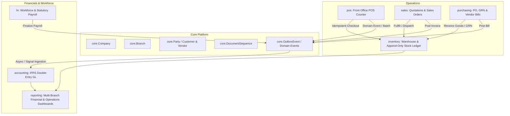

# Mini ERP Architecture & Implementation Specification

## 1. System Overview & Architectural Vision
This document outlines the architectural blueprint for upgrading the Django POS application into a unified, modular **Mini ERP**. The system connects POS counter operations, inventory management, purchasing, double-entry financial accounting (IFRS compliant), and human resources/payroll into a single source of truth.

---

## 2. Core Architecture Rules & Invariants

1. **Modular Service Boundary:**
   - Modules communicate via `services.py` functions and domain events / Django signals.
   - Cross-module writes directly to another module's database tables are strictly prohibited.
   - All complex query logic resides in `selectors.py`.
2. **Double-Entry Financial & Stock Ledgers (Append-Only):**
   - No `UPDATE` or `DELETE` on posted journal entries (`accounting.JournalEntryLine`) or posted inventory ledger movements (`inventory.StockLedgerEntry`).
   - Corrections must be made via reversal entries (`is_reversal=True`, `reversed_entry_id=...`).
3. **Strict Monetary & Concurrency Integrity:**
   - All money is stored as `DecimalField` with 2 decimal places.
   - Multi-row balance updates and document sequence counters must execute inside `transaction.atomic()` with `select_for_update()`.
4. **Multi-Tenancy & Multi-Branch Scoping:**
   - Every transactional model inherits from `BranchScopedModel` (or `CompanyScopedModel`).
5. **Document State Machine:**
   - All transactional documents (Sale, Purchase Order, GRN, Invoice, Bill, Payment, Journal Entry) adhere to standard lifecycles:
     $$\text{Draft} \xrightarrow{\text{validate}} \text{Confirmed / Approved} \xrightarrow{\text{post}} \text{Posted} \xrightarrow{\text{reverse}} \text{Cancelled / Reversed}$$

---

## 3. Phased Implementation Roadmap

| Phase | Module | Objectives & Scope | Dependencies | Est. Effort |
| :--- | :--- | :--- | :--- | :--- |
| **Phase 2** | **Core Platform & Tenancy** | Unify `Company`/`Branch` tenancy bridges; implement shared `Party` (Customer/Vendor base); standardize `DocumentSequence` and `OutboxEvent` dispatcher. | None | 2 Days |
| **Phase 3** | **Inventory & Stock Ledger** | Implement append-only `StockLedgerEntry`, perpetual Weighted Average / FIFO valuation, warehouse locations, atomic stock adjustments/transfers, and non-negative constraints. | Phase 2 | 3 Days |
| **Phase 4** | **Accounting Engine & Auto-Posting** | Connect posting rules, event subscribers for automatic GL journal generation, period closing safeguards, and reversal mechanics. | Phase 2, 3 | 3 Days |
| **Phase 5** | **Purchasing & AP Subledger** | Refactor POs, 3-way matching (PO $\rightarrow$ GRN $\rightarrow$ Vendor Bill), landed cost allocation, supplier payments, and AP aging. | Phase 2, 3, 4 | 2 Days |
| **Phase 6** | **Sales & POS Integration** | Unify B2B Sales Orders/Invoices with POS frontoffice counter; implement idempotent sale submission, cash drawer reconciliation, and AR posting. | Phase 2, 3, 4 | 3 Days |
| **Phase 7** | **HR & Payroll Accounting** | Automate payroll journal posting (Gross Wages, PAYE, NSSF, SHA, Housing Levy, Net Pay liabilities) into GL via decoupled events. | Phase 2, 4 | 2 Days |
| **Phase 8** | **Reporting & Dashboards** | Consolidated multi-branch P&L, Balance Sheet, Trial Balance, Stock Valuation, Sales Summary, and Cash Flow analytics. | Phase 3, 4, 5, 6 | 2 Days |
| **Phase 9** | **Permissions & Hardening** | Granular RBAC, branch query isolation, comprehensive unit/integration test suite, performance index optimization. | All | 2 Days |

---

## 4. Migration & Backward Compatibility Strategy

1. **Zero-Downtime Data Migration:**
   - New unified models in `core` will initially run with backward-compatibility properties and synchronization signals to legacy `pos` models (`pos.Business` $\leftrightarrow$ `core.Company`, `pos.Customer` $\leftrightarrow$ unified party).
2. **Stock Ledger Initialization:**
   - A dedicated data migration will generate initial `StockLedgerEntry` (Opening Balance) records matching existing `pos.BranchStock` quantities, ensuring zero inventory discrepancy.
3. **Rollback Safety:**
   - Every migration is paired with a symmetric reverse migration step.
